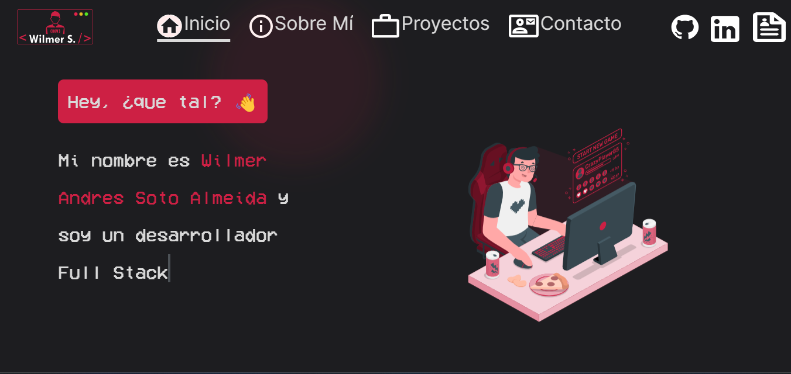

# Portflio WilSotoA 🥇



Este es mi proyecto de portafolio personal construido con Next.js, TypeScript y React. En este proyecto, muestro mi trabajo, habilidades y experiencia como desarrollador web.

## Demo en Vivo

Puedes ver una demostración en vivo de mi portafolio [aquí](https://wilsotoa.vercel.app).

## Características

- Diseño moderno y atractivo.
- Sección de inicio que destaca mi perfil y habilidades.
- Página de proyectos que muestra mis proyectos destacados.
- Página de contacto para que los visitantes se pongan en contacto conmigo.
- Totalmente responsive y compatible con dispositivos móviles.
- Desarrollado con Next.js para un rendimiento óptimo.

## Tecnologías Utilizadas

- Next.js
- React
- TypeScript
- CSS Modules

## Requisitos de Instalación

Asegúrate de tener Node.js y npm instalados en tu sistema antes de comenzar.

1. Clona este repositorio en tu máquina local usando `git clone`.

```bash
git clone https://github.com/WilSotoA/portflio.git
```

1.Navega al directorio del proyecto.

```bash
cd portflio
```

2.Instala las dependencias.

```bash
npm install
```

3.Inicia la aplicación en modo de desarrollo.

```bash
npm run dev
```

La aplicación estará disponible en <http://localhost:3000>.

## Licencia

Este proyecto está bajo la Licencia MIT - consulta el archivo LICENSE para más detalles.
